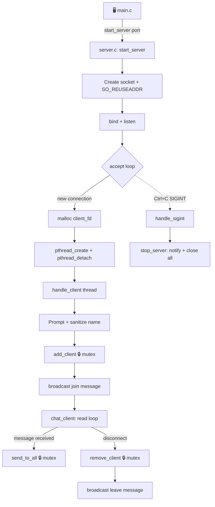

<div align="center">

# 💬 TCP Chat System

### A production-ready, thread-safe, multi-threaded TCP chat server — built in raw C.

*No frameworks. No shortcuts. Just sockets, threads, and mutexes doing exactly what they're told.*

[](https://en.wikipedia.org/wiki/C_(programming_language))
[](https://man7.org/linux/man-pages/man7/pthreads.7.html)
[](https://en.wikipedia.org/wiki/Berkeley_sockets)
[](#-testing)
[](#-license)

[View Repo](https://github.com/kwamekumiappiah/tcp_chat_system) · [Report a Bug](https://github.com/kwamekumiappiah/tcp_chat_system/issues) · [Connect on LinkedIn](https://www.linkedin.com/in/kwameappiah-kumi-appiah/)

</div>

---

## 🎯 1. Primary Goal

> Build a **production-ready, thread-safe, multi-threaded TCP chat server** in C, capable of managing concurrent users with dynamic naming, real-time message broadcasting, robust synchronization, and graceful lifecycle cleanup.

No Node.js event loop. No Python `asyncio`. Just raw POSIX sockets, `pthread`, and a mutex standing guard over shared memory — the way chat servers were built before frameworks did the thinking for you. 🧠

---

## 📺 2. What It Looks Like

```
$ ./build/server 8080
Chat server running on port 8080...
Alice joined the chat!
Bob joined the chat!
Alice: hello everyone 👋
Bob left the chat.
```

```
$ nc 127.0.0.1 8080
Enter your name: Alice
Bob joined the chat!
Bob: hey Alice!
```

Every terminal is a client. Every client is a thread. Every message is a broadcast. 🔁

---

## 🏗️ 3. Architecture



Each client gets its own **detached thread** — no `pthread_join` bookkeeping, no zombie threads. Every access to the shared `clients[]` array is wrapped in a mutex lock/unlock pair, so no two threads can step on each other's toes while broadcasting or updating connection state. 🧵🔒

---

## 🛠️ 4. What We Implemented

| Feature | Description |
|---|---|
| 🧵 **Multi-Threaded Architecture** | `pthread_create()` + `pthread_detach()` spin up an independent worker thread per client — no blocking, no waiting in line. |
| 🔒 **Thread-Safe Synchronization** | A POSIX mutex (`pthread_mutex_t`) guards the global `clients[]` array and `client_count`, eliminating data races during broadcast and connection updates. |
| 🔌 **Socket Configuration** | `SO_REUSEADDR` enables instant port re-binding on restart; the socket binds to `INADDR_ANY` on port `8080`. |
| 👤 **User Handshake & Custom Names** | New connections are prompted for a username, sanitized of trailing line breaks, and announced to the room (`"Alice joined the chat!"`). |
| ⚡ **O(1) Connection Removal** | Client removal uses a swap-and-pop algorithm instead of shifting the whole array — disconnects don't get slower as the room fills up. |
| 🛑 **Graceful Exit Handler** | `SIGINT` (Ctrl+C) triggers a clean shutdown: every client is notified, every socket closed, every mutex destroyed, every byte freed. |
| 🧱 **Modular Code Organization** | Split across `server.h`, `server.c`, and `main.c`, with internal state locked down using `static` — no leaking implementation details. |
| 📄 **Doxygen Documentation** | Every function carries `@brief`, `@param`, `@return`, and `@details` blocks, because future-you deserves better than cryptic one-liners. |

---

## 🐛 5. Challenges & Bugs Encountered

Building this wasn't a straight line — here's what actually broke along the way:

* ⌛ **Port Lockout (`Address already in use`)** — Restarting the server failed because the old socket sat trapped in the kernel's `TIME_WAIT` state.
* 📢 **Duplicate Disconnect Announcements** — Leave messages were printed *twice* whenever a client disconnected.
* 🧹 **Trailing Line Breaks in Usernames** — Raw input from terminal clients like `netcat` appended `\r\n` or `\n`, corrupting message formatting into things like `"Alice\n: hello"`.
* ⚠️ **Compiler Parameter Mismatch** — Function signatures drifted out of sync once extra arguments (like `name`) were threaded into `chat_client()`.
* 📜 **Monolithic Single-File Risk** — Housing all networking, threading, and state in one `main.c` created tight coupling and left shared state exposed to accidental modification.

---

## 💡 6. Fixes & Workarounds Applied

* ⚡ **`SO_REUSEADDR` + `SIGINT` Handler** — Socket options were configured to override port retention, and `handle_sigint()` now closes `server_fd` cleanly on shutdown.
* 🎯 **Single Responsibility Cleanup** — Exit broadcasts were pulled out of `chat_client()` entirely, concentrating all disconnect logic inside `handle_client()`.
* ✂️ **Null-Terminator Insertion with `strcspn()`** — Input is sanitized with `name[strcspn(name, "\r\n")] = '\0';`, cleanly stripping carriage returns and newlines.
* 🔄 **Signature Alignment** — Function prototypes across the header and implementation were synchronized to match exactly (`chat_client(int client_fd, char *name)`).
* 🛡️ **Encapsulated API Design** — Internal state like `clients[]` is kept `static` to `server.c`, exposing only two high-level functions in `server.h`: `start_server()` and `stop_server()`.

---

## 🧠 7. Key Technical Concepts & Takeaways

* 🏎️ **Data Race Prevention** — Concurrent read/write access to shared memory without mutual exclusion is undefined behavior, full stop. The mutex isn't optional — it's the whole ballgame.
* 📐 **High Cohesion & Low Coupling** — Keeping internal state private to `server.c` shields core data structures from accidental (or malicious) modification from `main.c`.
* 🧹 **Resource Reclamation** — Every socket file descriptor gets closed, every heap-allocated thread argument gets freed. In C, nothing cleans up after you but you.

---

## 📁 8. Project Structure

```
tcp_chat_system/
├── build/
│   └── server              # 🏗️ compiled binary (generated, not committed)
├── include/
│   └── server.h             # 📜 public API surface
├── src/
│   ├── main.c                # 🚪 entry point
│   └── server.c              # ⚙️ core server logic (sockets, threads, mutex)
├── test/
│   └── test_chat_server.py  # 🧪 black-box integration tests
└── README.md                 # 📖 you are here
```

---

## 🚀 9. Getting Started

### Prerequisites
- A POSIX-ish environment (Linux, macOS, WSL) 🐧
- `gcc` and `pthread` support
- Python 3 (for running the test suite — no extra packages needed)

### Build

```bash
gcc -Wall -Wextra -Iinclude -pthread -o build/server src/main.c src/server.c
```

### Run

```bash
./build/server 8080
```

Then, in another terminal (or several 👀):

```bash
nc 127.0.0.1 8080
```

Type a name, hit enter, and start chatting. Open more terminals to simulate more users.

Stop the server anytime with `Ctrl+C` — it'll clean up gracefully. 🛑

---

## 🧪 10. Testing

This project ships with a full black-box integration test suite that spins up the *real* compiled binary and drives it over actual TCP sockets — the same way a real client would.

```bash
python3 test/test_chat_server.py
```

Expected output:

```
PASS  test_prompts_for_name
PASS  test_join_announcement_broadcast
PASS  test_message_broadcast_excludes_sender
PASS  test_leave_announcement_broadcast
PASS  test_three_way_broadcast
PASS  test_name_with_trailing_crlf_is_trimmed
PASS  test_client_disconnect_does_not_crash_server

7 passed, 0 failed
```

Why black-box? All server state (`clients[]`, `client_count`, the mutex) is `static` inside `server.c` — there's nothing to unit-test directly without exposing internals the design deliberately hides. So the tests treat the server exactly like a client would: connect, send, listen, disconnect, repeat. ✅

---

## 🗺️ 11. Roadmap / Ideas for Later

- [ ] Private messaging (`/msg <name> <text>`)
- [ ] Chat rooms / channels
- [ ] Configurable `MAX_CLIENTS` with a graceful "server full" response
- [ ] TLS support for encrypted connections
- [ ] Persistent chat logs

---

## 👤 12. Author

**Kwame Appiah Kumi-Appiah**

[](https://github.com/kwamekumiappiah)
[](https://www.linkedin.com/in/kwameappiah-kumi-appiah/)
[](mailto:kwameappiahkumi@gmail.com)

---

## 📜 13. License

This project is open-sourced under the MIT License — use it, learn from it, break it, fix it. 🔧

<div align="center">

**⭐ If this project helped you understand sockets, threads, or mutexes a little better, consider giving it a star!**

</div>